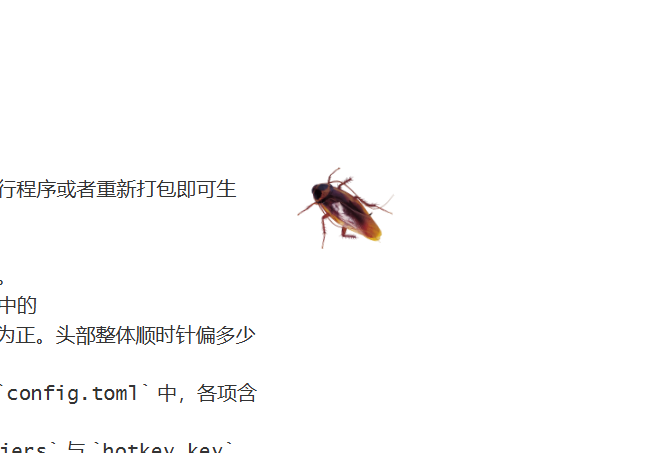

# DesktopPet 桌面宠物

基于 PyQt5 的 Windows 桌面爬行宠物

目前默认是一只可爱的小蟑螂🫣 支持自定义图片素材、运动轨迹等

如果觉得有趣可以给个小小的 star 🌟

## 功能特性

- 随机变向与变速，触及屏幕边界自动反弹。
- 全局热键 `Alt + \` 切换显示与隐藏。
- 鼠标左键拖动宠物到任意位置。

## 下载可执行 exe 文件

不想拉代码装环境可以直接下载 release 版本：[v1.0 release版](https://github.com/idleRain/desktop-pet/releases/tag/v1.0)

## 运行

### 环境

需要 Python 3.11 及以上版本，因配置文件采用内置的 tomllib 解析。安装依赖：

```
pip install -r requirements.txt
```

装不上的小同志可以设置国内镜像再尝试上面的安装命令
```
# 1. 设置默认的包下载源为清华镜像
pip config set global.index-url https://pypi.tuna.tsinghua.edu.cn/simple
# 2. 将该镜像地址设为可信任主机，避免SSL证书错误
pip config set global.trusted-host pypi.tuna.tsinghua.edu.cn
```

### 运行

```
python src\desktop_pet.py
```

### 打包为 exe (推荐)

执行：

```
python build.py
```

成品位于 `dist\DesktopPet.exe`。

### 测试

```
python -m unittest discover tests
```


## 自定义

所有可调参数集中在项目根目录的 `config.toml`，修改后重新运行程序或者重新打包即可生效。

- **替换素材**：将新图片命名为 `pet.png` 放入 `assets` 目录。
- **调整头部朝向**：素材头部朝向不同时，修改 `config.toml` 中的 `head_heading_deg`。该值采用导航角制，正上方为 0°，顺时针为正。头部整体顺时针偏多少度，就把该值加上多少度。
- **调整动画参数**：速度、颠簸幅度、倾斜幅度、变向间隔等均在 `config.toml` 中，各项含义见文件内注释。
- **调整全局热键**：修改 `config.toml` 中的 `hotkey_modifiers` 与 `hotkey_key`。`hotkey_modifiers` 为修饰键位掩码，Alt 为 1、Ctrl 为 2、Shift 为 4、Win 为 8，可按位相加；`hotkey_key` 为虚拟键码。


---

最后附上可爱的小蟑螂🫣

